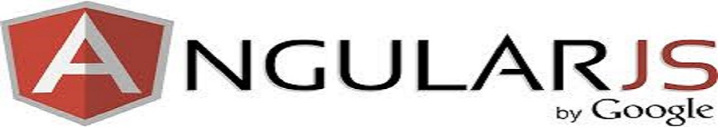

> 本开源书 forked from [AngularJS 学习笔记](https://github.com/checkcheckzz/AngularJS-Learning-Notes)，作者为 [checkcheckzz](https://github.com/checkcheckzz)，欢迎大家 star 原作者的 [repo](https://github.com/checkcheckzz/AngularJS-Learning-Notes)，以便获得最新更新，谢谢！

> AngularJS-Learning-Notes

*此教程由邹业盛原创，本项目仅为gitbook在线版本。 本文的内容是在 1.0.x 版本之下完成的。*

**作者GitHub帐号**

[GitHub](https://github.com/zephyrzou)

**作者原文章连接**

[AngularJS学习笔记](http://www.zouyesheng.com/angular.html)

# 在线阅读

使用Gitbook制作，可以直接[在线阅读](http://checkcheckzz.gitbooks.io/angularjs-learning-notes/)。

# 电子书下载

dropbox PDF→[点我下载](https://www.dropbox.com/s/p15m0ezvwiqcqag/angularjs-learning-notes.pdf)

百度云 PDF→[点我下载](http://pan.baidu.com/s/1i3EBVNZ)

其他格式可以通过PDF转换

# 协议

基于[WTFPL](http://en.wikipedia.org/wiki/WTFPL)协议开源。
